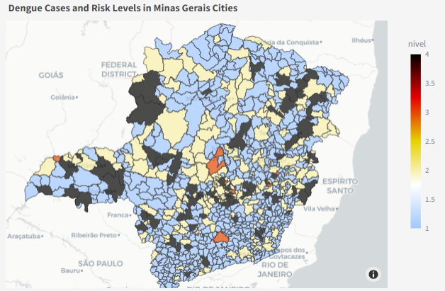

# Dengue Tracker

This is a Streamlit web application for visualizing dengue cases and risk levels in cities of Minas Gerais, Brazil.

## Introduction

This application provides interactive maps and data visualization tools to explore dengue-related information in different cities of Minas Gerais. Users can select the year and epidemiological week to view the dengue cases and risk levels across various cities. The data is actively updated by INFO Dengue, a platform dedicated to providing information on Dengue and Chikungunya cases.



## Features

- Interactive choropleth map showing dengue cases and risk levels in Minas Gerais cities.
- Selectable year and epidemiological week to view data for specific periods.
- Sidebar with total dengue cases.

## Data Sources

- Dengue cases and risk levels data: [INFO Dengue](https://info.dengue.mat.br/)
- Geographical data for Minas Gerais cities: [IBGE](https://www.ibge.gov.br/)

## Usage

To run this application locally, you'll need to have Python and Streamlit installed. Once installed, you can clone this repository and run the following commands:

```bash
pip install -r requirements.txt
streamlit run dengue_tracker.py
